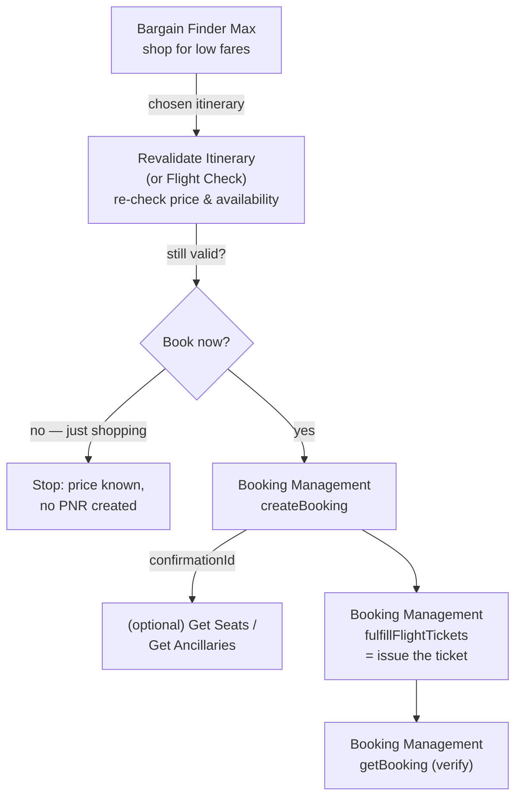
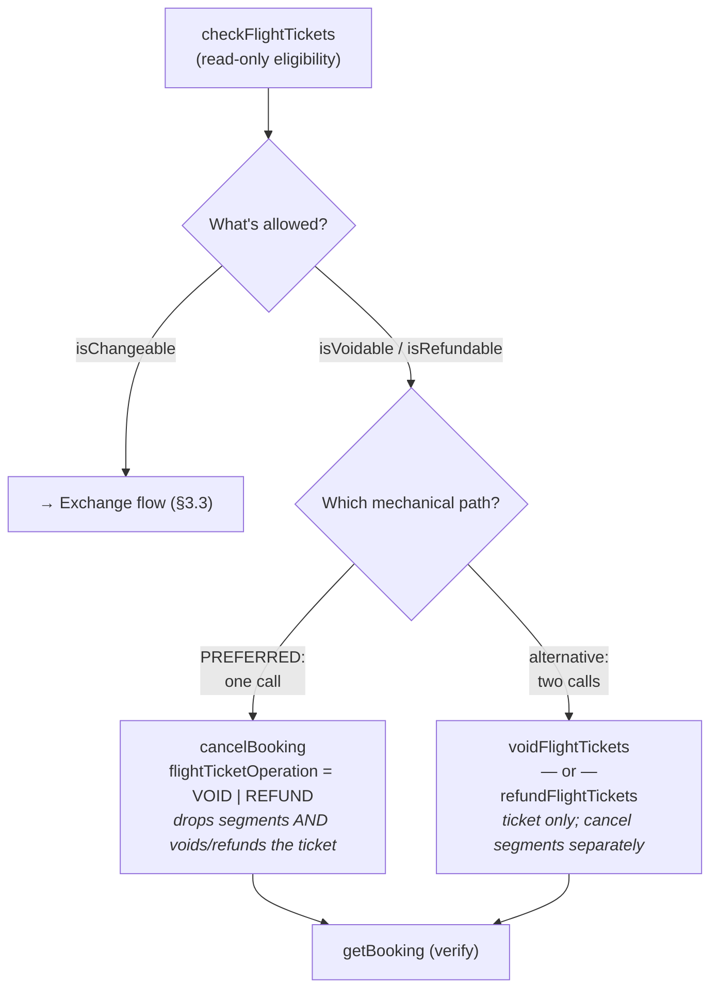
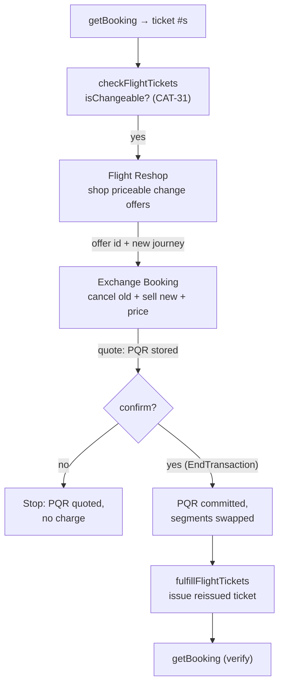
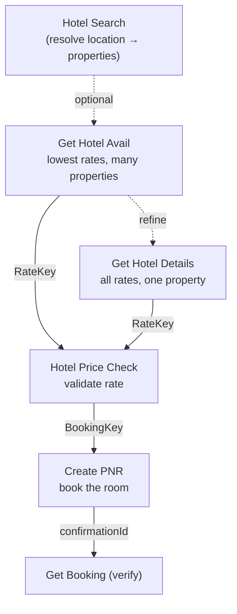
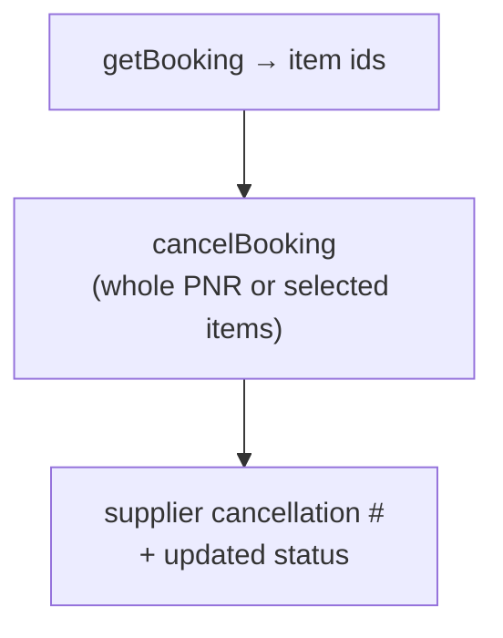
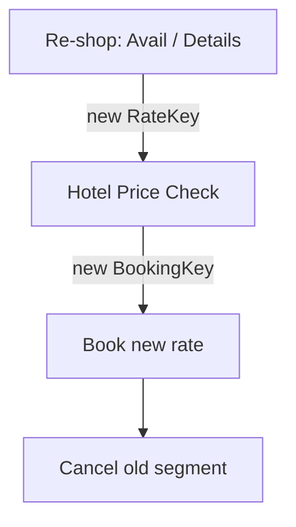

# Sabre API Primer & Study Guide

A conceptual tour of the **Sabre REST APIs** this project wraps — what each one
is for, when you call it, and when a real human (traveler or agent) has to
supply something. It is written about **Sabre's APIs as Sabre defines them**,
not about this library's wrapper around them.

> **Why this doc exists.** Use it as a *correctness yardstick*. Read it beside
> our implementation and ask: *did we model Sabre's actual contract faithfully?*
> Because it describes Sabre's intent independently — sourced from the Sabre
> Developer Hub and the OpenAPI specs in [`docs/specifications/`](../specifications/) —
> it is only useful as a check if it stays honest to Sabre and silent about our
> code. So you will not find our type names, CLI flags, or wrapper defaults
> here. Where Sabre leaves a genuine choice open, this guide flags it as a
> decision point so a reviewer knows to go check which path we took.

## How to read this guide

Two kinds of margin notes appear throughout. They are deliberately styled so
you can skim past the prose and still catch them:

> ⚖️ **Sabre decision point** — Sabre offers a real choice or leaves a field
> optional here. The choice has consequences. A reviewer should confirm which
> way our implementation went and whether that was the right call.

> ⚠️ **Production reality** — something verified against CERT or production that
> the spec alone does not tell you. These are the sharp edges.

> ✅ **Preferred for this project** — where Sabre offers more than one way and we
> have a recommended default, this marks it.

> 📎 **Heritage note** — legacy (usually SOAP) context that helps when reading
> older Sabre docs, but isn't the modern path.

Everything else is plain description. Field names are quoted **`like this`** and
match the on-the-wire Sabre casing exactly; they are called out only when the
field is non-obvious, never field-by-field.

---

## 1. Documentation reference

### 1.1 API reference

One row per API (and per operation, where a single API bundles several). The
**path** column gives the exact endpoint; the **Sabre reference** links to that
API's own Developer Hub page — canonical description, full schema, "Try It Out."

> **Reading the table.** **Booking Management** is one product with eight
> operations, so it appears as a group header (the docs link sits on the header)
> with its operations indented (`↳`) beneath. The blank reference cells on those
> rows mean "same page as the header," not "missing."

| API / operation | Purpose | Method + path | Sabre reference |
| --- | --- | --- | --- |
| **Bargain Finder Max** | Low-fare air shopping | `POST /v5/offers/shop` | [Bargain Finder Max](https://developer.sabre.com/rest-api/bargain-finder-max) |
| **Revalidate Itinerary** | Re-price/re-check one itinerary before booking | `POST /v5/shop/flights/revalidate` | [Revalidate Itinerary](https://developer.sabre.com/rest-api/revalidate-itinerary) |
| **Flight Check** | Agentic re-check of a cached offer; *slated to replace Revalidate Itinerary* | `POST /v1/offers/flightCheck` | [Flight Check API](https://developer.sabre.com/rest-api/flightcheck-api/v1/index.html) |
| **Booking Management** | Manage a reservation: book, retrieve, modify, cancel, and ticket ops | — | [Booking Management API](https://developer.sabre.com/rest-api/booking-management-api) |
| ↳ getBooking | Retrieve a booking by `confirmationId` (stateless) | `POST /v1/trip/orders/getBooking` | |
| ↳ createBooking | Create an air booking (ATPCO/NDC/LCC) | `POST /v1/trip/orders/createBooking` | |
| ↳ modifyBooking | Change non-itinerary data (names, contacts, remarks) | `POST /v1/trip/orders/modifyBooking` | |
| ↳ cancelBooking | Cancel the booking/items, optionally void/refund tickets | `POST /v1/trip/orders/cancelBooking` | |
| ↳ checkFlightTickets | Ticket eligibility: void / refund / exchange (CAT-31/33) | `POST /v1/trip/orders/checkFlightTickets` | |
| ↳ voidFlightTickets | Void issued tickets by number | `POST /v1/trip/orders/voidFlightTickets` | |
| ↳ refundFlightTickets | Refund tickets/EMDs (minus penalties) | `POST /v1/trip/orders/refundFlightTickets` | |
| ↳ fulfillFlightTickets | Issue (fulfill) tickets against a stored fare | `POST /v1/trip/orders/fulfillFlightTickets` | |
| **Flight Reshop** | Shop for *exchangeable* itineraries (priceable change offers) | `POST /v1/offers/flightReshop` | [Flight Reshop API](https://developer.sabre.com/rest-api/flight-reshop-api/1.0) |
| **Exchange Booking** | Commit an exchange: cancel + rebook + reprice → PQR | `POST /v1.1.0/exchange/booking` | [Exchange Booking](https://developer.sabre.com/rest-api/exchange-booking/1.1.0) |
| **Get Ancillaries** | List flight ancillaries (bags, etc.) in NDC format | `POST /v2/offers/getAncillaries` | [Get Ancillaries (Agency)](https://developer.sabre.com/rest-api/get-ancillaries-agency/2.2) |
| **Get Seats** | Seat map + paid-seat pricing | `POST /v1/offers/getseats` | [Get Seats](https://developer.sabre.com/rest-api/get-seats/2.0) |
| **Get Hotel Avail** | Lowest rates across many properties | `POST /v5/get/hotelavail` | [Get Hotel Avail](https://developer.sabre.com/rest-api/get-hotel-avail/v5.0) |
| **Get Hotel Details** | All rates/rooms for one property | `POST /v5/get/hoteldetails` | [Get Hotel Details](https://developer.sabre.com/rest-api/get-hotel-details/v5.1) |
| **Get Hotel Rate Info** | All rates for one property (granular) | `POST /v5/get/hotelrateinfo` | [Get Hotel Rate Info](https://developer.sabre.com/rest-api/get-hotel-rate-info/v5) |
| **Hotel Price Check** | Validate a rate, mint a `BookingKey` | `POST /v5/hotel/pricecheck` | [Hotel Price Check](https://developer.sabre.com/rest-api/hotel-price-check/v5) |
| **Hotel Search** | Resolve location → list of properties | `POST /v2.0.0/hotel/search` | [Hotel Search](https://developer.sabre.com/rest-api/hotel-search/v2) |
| **Create Passenger Name Record** | Book a hotel (create the PNR) | `POST /v2.5.0/passenger/records?mode=create` | [Create Passenger Name Record](https://developer.sabre.com/rest-api/create-passenger-name-record/2.5.0) |
| **Airline Lookup** | Airline code → name | `GET /v1/lists/utilities/airlines` | [Airline Lookup](https://developer.sabre.com/rest-api/airline-lookup/v1) |
| **Airline Alliance Lookup** | Alliance → member airlines | `GET /v1/lists/utilities/airlines/alliances` | [Airline Alliance Lookup](https://developer.sabre.com/rest-api/airline-alliance-lookup/v1) |
| **Multi-Airport City Lookup** | City code ↔ its airports (MAC) | `GET /v1/lists/supported/cities` | [Multi-Airport City Lookup](https://developer.sabre.com/rest-api/multi-airport-city-lookup/v1) |

> ⚖️ **Sabre decision point — Flight Check vs. Revalidate Itinerary.** Sabre's
> Flight Check page states it *"will replace the Revalidate Itinerary API and the
> Offer Price API, integrating their capabilities into one single service."* It
> revalidates a cached offer's price/availability **without** holding or
> decrementing inventory (cache-based, "Sabre IQ" / Agentic), supports ATPCO
> (payload) and NDC (`offerItemID`), and returns the data needed to create the
> order. It is **premium and activation-gated** (enabled via an internal Sabre
> ticket), so it is not exercised here. A reviewer choosing the re-check step
> should know Revalidate is the implemented path today and Flight Check is the
> direction Sabre is pointing. See §3.1.

### 1.2 Workflow & concept guides

Sabre's prose guides explain how the APIs above chain into a flow, and the
concepts behind them. These describe *journeys*, not single endpoints.

| Guide | What it covers |
| --- | --- |
| [Air Booking](https://developer.sabre.com/guide/air-booking/air-booking.html) | Shop → revalidate → (seats/ancillaries) → create booking — the §3.1 flow |
| [Issue Air Ticket](https://developer.sabre.com/guide/issue-air-ticket/issue-air-ticket.html) | Fulfillment: issuing a ticket against a stored fare, incl. quality-control gate |
| [Auto Price Air Exchange](https://developer.sabre.com/guide/auto-price-air-exchange/auto-price-air-exchange.html) | Exchange/reissue (CAT-31), PQR, and how Exchange Booking replaces the SOAP steps |
| [End-to-End Exchanges](https://developer.sabre.com/guide/end-to-end-exchanges-workflows/end-to-end-exchanges-workflows.html) | Legacy SOAP exchange path (heritage context for §3.3) |
| [Post Booking Transaction](https://developer.sabre.com/guide/post-booking-transaction/post-booking-transaction.html) | Retrieve → cancel → end-transact (legacy cancel context for §3.2) |
| [Get Ancillaries](https://developer.sabre.com/guide/get-ancillaries/get-ancillaries.html) | Shopping vs. selling ancillaries |
| [Reserve Air Seats](https://developer.sabre.com/guide/reserve-air-seats/reserve-air-seats.html) | Seat display and paid-seat sell |
| [Content Services for Lodging (CSL)](https://developer.sabre.com/product-collection/content-services-for-lodging-csl/v1/setup-and-guides.html) | The whole hotel shop → book → cancel flow; orchestrated vs. granular APIs |
| [CSL API Support](https://developer.sabre.com/product-collection/content-services-for-lodging-csl/v1/help-documentation/csl-api-support.html) | Hotel test data, OTA codes, error messages |
| [Intro to PNRs](https://developer.sabre.com/guide/pnrs/pnrs.html) | What a PNR is, the PRINT minimum-fields mnemonic |
| [Glossary](https://developer.sabre.com/guide/glossary/glossary.html) | Sabre terminology |

> **On versions.** The reference links above are mostly version-pinned to match
> what this project targets (e.g. Exchange Booking `1.1.0`, Create PNR `2.5.0`).
> Sabre keeps older versions published; if a link ever 404s, drop the trailing
> version segment to land on the current default.

---

## 2. Concepts that cut across everything

Read this once; it makes every flow below shorter.

**Authentication.** Every call carries `Authorization: Bearer <token>`. The
token comes from an OAuth 2.0 *client-credentials* exchange at `/v2/auth/token`
(client id + secret → short-lived access token). There are no refresh tokens;
you re-auth when the token expires. This is orthogonal to the business APIs and
the same for all of them.

**PNR vs. Order.** A **PNR** (Passenger Name Record) is the classic Sabre
reservation container. An **Order** is the newer NDC-era container. Modern
Booking Management is "normalized" — it presents a single view over *both* and
most callers can treat `confirmationId` as the one handle that identifies a
reservation regardless of which container backs it.

**What a PNR minimally needs — "PRINT".** Sabre's own mnemonic for the required
fields of any PNR:

| Letter | Field | Who supplies it |
| --- | --- | --- |
| **P** | Phone number | Traveler |
| **R** | Received-from | Agent (who authorized the change) |
| **I** | Itinerary | From the shop/avail step |
| **N** | Name | Traveler |
| **T** | Ticketing time limit | Agency policy / fare rule |

> ⚖️ **Sabre decision point** — `received-from` ("RF") is required by Sabre for
> any transaction that ends (commits) a PNR — bookings, exchanges, cancels. It
> is a free-text "who asked for this" string, not validated. Confirm every
> commit path in our code populates it; a missing RF is a classic silent
> end-transact failure.

**Handles chain the flow together.** Almost every multi-step flow works by one
call minting an opaque token that the next call consumes. The whole point of
these tokens is that you do *not* reconstruct the priced option by hand — you
pass the token. The important ones:

| Handle | Minted by | Consumed by | Means |
| --- | --- | --- | --- |
| `RateKey` | Hotel Avail / Details / Rate Info | Hotel Price Check | "this rate, this property, these dates" |
| `BookingKey` | Hotel Price Check | Create PNR | "this rate, validated & still available" |
| offer id | Flight Reshop | Exchange Booking | "this priceable change option" |
| `PQR_Number` | Exchange Booking | Fulfill (ticketing) | "this Price Quote Reissue record" |
| ticket number (13-digit) | Fulfill / issuance | Check / Void / Refund / Reshop | "this issued document" |
| `confirmationId` | Create Booking / Create PNR | every Booking Mgmt op | "this reservation" |

**Segment status codes (`NN`, `GK`, `SS`, `HK`…).** Every segment in a PNR —
flight, hotel, car — carries a two-letter status code. These come from the old
IATA teletype standard (AIRIMP) and are the same across every GDS. The single
most important thing to understand is that the same little code field plays
**two roles**, depending on who just wrote in it:

- **A request** — what the *agent* puts on a segment when adding it ("here's what
  I want").
- **A status** — what the *airline* writes back after processing, and what the
  segment finally settles to ("here's how it turned out").

So one segment tells a story, read top to bottom. The normal life of a flight
segment is a little back-and-forth:

| Step | Code | Who wrote it | Meaning |
| --- | --- | --- | --- |
| 1. Request | `NN` ("Need") | Agent | "I need a seat on this flight." Pending — ball's in the airline's court |
| 2. Reply | `KK` ("Confirmed") | Airline | "Confirmed." (Or `UC` "Unable" if there's no space) |
| 3. Settled | `HK` ("Holds Confirmed") | System, after end-transact | The durable "this is real and held" you'd see tomorrow |

That is: *I asked (`NN`) → they said yes (`KK`) → it's now held (`HK`).* Three
different marks because they're three different moments — request, reply,
settled — all living in the same field.

**The passive exception — `GK`.** Sometimes the agent isn't *asking* the airline
anything; they're *recording something already true elsewhere* (the segment was
confirmed directly with the carrier, or in another system). Instead of writing
`NN` (a question) and waiting, the agent writes `GK` — "this is already
confirmed" — straight onto the segment and moves on. **No message is sent to the
airline; no reply comes back.** The segment *looks* settled from the first
stroke. `GK` is the one case where the request *is* the final state, because no
question was ever asked — it's a statement, not a question. (`SS` — "Sell/Sold" —
tries to ask *and* confirm from live availability in one stroke.)

| Code | Name | Role |
| --- | --- | --- |
| `NN` | Need | Request — pending, awaiting carrier |
| `SS` | Sell/Sold | Request — sell-and-confirm from live availability in one shot |
| `GK` | Passive confirmed | **Statement** — recorded as confirmed locally, no carrier message sent |
| `KK` | Confirmed | Airline's reply to an `NN` |
| `HK` | Holds Confirmed | Settled, durable confirmed state |
| `HL` | Have Listed | Settled waitlist |
| `UC` / `US` | Unable / Unable-waitlisted | Airline's reply: couldn't confirm |

> ⚖️ **Sabre decision point** — this request-vs-statement distinction is the
> entire reason the exchange flow (§3.3) is fussy about which status it sells new
> segments as. The host's *HaltOnStatus* list refuses to end a transaction while
> a segment is still a pending **request** (`NN` and the unsettled replies), so a
> reissue sold as `NN` aborts; `GK` (a **statement**) reads as settled instantly
> and lets the reissue price in one call — at the cost that no carrier locator is
> ever assigned. See §3.3 for how that plays out.

**Environments.** Two base hosts, and they differ by API family:

| Family | CERT | Production |
| --- | --- | --- |
| Air & Booking Mgmt (modern REST) | `https://api.cert.platform.sabre.com` | `https://api.platform.sabre.com` |
| Hotel (CSL) | `https://api-crt.cert.havail.sabre.com` | `https://api.platform.sabre.com` |

> ⚠️ **Production reality** — the hotel CSL CERT host (`havail.sabre.com`) is a
> different domain from the air CERT host. A flow that touches both air and
> hotel is talking to two different Sabre back ends.

---

## 3. Flights

### 3.1 Search → Book (one progressive flow)

Searching and booking are the *same pipeline*. "Search" is a legitimate place
to stop (price shopping, a fare display, no reservation created); "booking" is
that same pipeline carried two steps further. Sabre's own **Air Booking**
workflow lays it out as: shop → revalidate → (optional seats/ancillaries) →
create booking → (later) fulfill.

| Step | API | Mandatory? | Creates/changes a reservation? | Human input needed |
| --- | --- | --- | --- | --- |
| Shop | Bargain Finder Max | Yes (to discover fares) | No | Trip: cities, dates, pax counts/types, cabin |
| Re-check | Revalidate Itinerary (or Flight Check) | **Yes, before booking** | No | None (system step) |
| Seats | Get Seats | Optional | No (display) | Seat preference (if selling) |
| Ancillaries | Get Ancillaries | Optional | No (display) | Which extras to add |
| Book | Booking Management `createBooking` | Yes (to create a PNR) | **Yes** | Traveler PRINT data, form of payment |
| Ticket | Booking Management `fulfillFlightTickets` | Yes (to issue) | **Yes** | Form of payment / ticketing approval |
| Verify | Booking Management `getBooking` | Optional | No | None |

**Bargain Finder Max** — *"our best-in-class low fare search product… the lowest
available priced itineraries based upon a specific date."* `POST /v5/offers/shop`.
You describe the journey and the passengers; you get back ranked priced
itineraries. It is **read-only** — it never creates a PNR.

- The trip is described as one or more origin/destination pairs
  (`OriginDestinationInformation`) plus a passenger summary
  (`PassengerTypeQuantity`, e.g. `ADT`/`CHD`/`INF` counts). Those passenger
  *type codes* drive the whole pricing matrix.
- `TravelPreferences` is where carrier/cabin/stop filters live — it shapes which
  itineraries even appear.

> ⚖️ **Sabre decision point** — `TPA_Extensions.IntelliSellTransaction.RequestType.Name`
> (e.g. `"50ITINS"`) controls *how many* itinerary groups Sabre assembles.
> Bigger = more options, slower, more expensive. The spec also pins `version`
> (`"5"`) and a response format. Confirm our request fixes these intentionally
> rather than relying on Sabre defaults that can shift.

**Revalidate Itinerary** — *"recheck availability and pricing for a specific
itinerary option without booking the itinerary… revalidates if the itinerary
option is valid for purchase. NDC content is not supported."*
`POST /v5/shop/flights/revalidate`. Shopping results go stale in seconds — seats
sell, fares move. Revalidate is the "is this still real and still this price?"
gate. It is read-only.

> ⚠️ **Production reality** — Revalidate is **mandatory between search and
> `createBooking`** in this project; it is never skipped. A price that looked
> right in BFM can be gone by the time the traveler clicks "book," and skipping
> revalidation pushes that failure into the (mutating, billable) booking call
> instead of catching it cheaply here.

> ⚖️ **Sabre decision point** — Revalidate **does not support NDC** content. So
> the "re-check before book" guarantee only holds for ATPCO itineraries. For an
> NDC offer, the equivalent freshness check is a different mechanism (see Flight
> Check, next). Worth confirming how our flow treats NDC offers at this step.

**Flight Check** *(the re-check Sabre is moving toward)* — `POST /v1/offers/flightCheck`.
Sabre describes this as a **multi-source** API that recreates a *cached* offer
into a bookable one, revalidating its price/availability **without holding or
decrementing airline inventory** ("Sabre IQ" / Agentic, cache-based). It fills
the gap above: it covers **both ATPCO (payload) and NDC (`offerItemID`)**, and
its own docs say it *"will replace the Revalidate Itinerary API and the Offer
Price API."* Functionally it sits in the same slot as Revalidate — the
"is this still real and still this price?" gate before booking.

> ⚖️ **Sabre decision point — which re-check do we use?** Revalidate Itinerary is
> the implemented, generally-available path (ATPCO only). Flight Check is the
> strategic replacement (ATPCO **and** NDC) but is **premium and
> activation-gated** — it requires an internal Sabre ticket to enable, and is not
> exercised in this project. A reviewer should treat Revalidate as today's
> answer and Flight Check as the migration target — and, for NDC offers
> specifically, recognize Flight Check is the only one of the two that applies.

**Booking Management `createBooking`** — `POST /v1/trip/orders/createBooking`.
Sabre's air booking guide: *"books all flights, prices and stores fares, and
adds all necessary data/special requests… within a single API call,"* returning
the Sabre `confirmationId` plus the airline confirmation id(s). This is the
first call in the flow that **mutates** — it creates the PNR/Order. This is
where the traveler's PRINT data and form of payment must be present.

**Booking Management `fulfillFlightTickets`** — `POST /v1/trip/orders/fulfillFlightTickets`.
Booking creates and *stores a fare*; fulfillment **issues the ticket** against
it (Sabre calls this "fulfillment"). Sabre's guide stresses a **quality-control**
gate before fulfilling: validate form of payment, confirm traveler data, and —
especially if ticketing on a later day than booking — re-check segment status
and that the stored price is still valid. One stored fare can issue multiple
tickets (one per passenger).

> ⚖️ **Sabre decision point** — fulfillment carries qualifier flags that change
> behavior materially: `acceptPriceChanges` (issue even if the live price drifted
> from the stored quote), `acceptNegotiatedFare`, `retainAccounting`, and a
> `printerAddress`/country designation (some PCCs *require* a designated ticket
> printer). Each is a policy decision — confirm our defaults match the agency's
> intent, not just "whatever lets the call succeed."

---

### 3.2 Cancel — void vs. refund

Cancelling a ticketed flight is really two questions. **First**, the financial
one: should the ticket be **voided** (reversed as if never sold) or **refunded**
(returned minus penalties)? These are different money operations and picking the
wrong one is a money error, not a formatting error. **Second**, the mechanical
one: do you do it in **one call** or **two**? Sabre supports both, and they reach
the same outcome by different routes.

| | **Void** | **Refund** |
| --- | --- | --- |
| Outcome | Full reversal, as if never sold | Original amount **minus penalties** (CAT-33) |
| When | Same-day reversal (short window, e.g. before midnight POS time) | After the void window; governed by fare rules |
| Gate field | `Ticket.isVoidable` | `Ticket.isRefundable`, `Ticket.isAutomatedRefundsEligible` |
| One-call value | `flightTicketOperation: VOID` | `flightTicketOperation: REFUND` |
| Dedicated endpoint | `voidFlightTickets` | `refundFlightTickets` |

**Check Flight Tickets** — `POST /v1/trip/orders/checkFlightTickets`. *"Check
tickets for void, refund, and exchange conditions."* Read-only; returns, per
ticket, `isVoidable` / `isRefundable` / `isChangeable` plus the estimated
penalties (`refundPenalties` for CAT-33, `exchangePenalties` for CAT-31). Always
the **first** step — the eligibility data only exists once a coupon is open
(i.e., the ticket is issued). The same call also surfaces an `offerItemId` per
ticket, which the one-call path below consumes for NDC orders.

> ⚠️ **Production reality** — penalty figures from `checkFlightTickets` are
> *estimates* that assume the worst case (highest possible penalty / all fare
> components changed). Treat them as an upper bound for display, not a quote.

> ⚖️ **Sabre decision point** — the refund side has an
> `isAutomatedRefundsEligible` flag that tells you whether *automated* refund
> processing is provisioned. There is **no equivalent flag for exchanges** — a
> `true` on `isChangeable` tells you the fare rule permits a change, but **not**
> that automated reissue is turned on for your PCC. (See §3.3 — this gap is the
> single biggest exchange trap.)

#### Path A — one call (preferred): `cancelBooking` with `flightTicketOperation`

`POST /v1/trip/orders/cancelBooking` — *"cancels a booking or specified booking
items, optionally voiding or refunding related flight tickets."* In a single
call it both **drops the segments** and **reverses the money on the ticket**.
The financial action is selected by one field:

- **`flightTicketOperation`** — `VOID` or `REFUND`. Present ⇒ the matching ticket
  operation runs as part of the cancel. Absent ⇒ segments are cancelled but the
  ticket is left untouched (itinerary tidy-up only).
- **What to cancel** — `cancelAll: true` for the whole reservation, or list
  specific items (`flights[]`, `hotels[]`, `segments[]`, …). One unified service
  handles a mixed PNR.
- **`errorHandlingPolicy`** — `HALT_ON_ERROR` (default) vs. `ALLOW_PARTIAL_CANCEL`:
  do you want all-or-nothing, or "cancel what you can"?
- **`receivedFrom`** — required to end the transaction (the PNR "RF"; see §2).
- **`offerItemId`** — for **NDC** orders, the void/refund offer id taken from the
  `checkFlightTickets` response. (ATPCO doesn't need it.)

> ✅ **Preferred for this project.** One call is atomic from the caller's point
> of view — the cancel and the void/refund either happen together or the
> `errorHandlingPolicy` governs the partial outcome explicitly, instead of you
> orchestrating two calls and reconciling a half-done state if the second fails.

#### Path B — two calls (alternative): dedicated ticket endpoints

When you need to act on the **ticket independently of the itinerary** — e.g. void
a document without touching segments, batch-void several ticket numbers, or apply
refund qualifiers the cancel envelope doesn't expose — use the dedicated
endpoints and manage segment cancellation separately:

- **`voidFlightTickets`** — `POST /v1/trip/orders/voidFlightTickets`. Voids the
  ticket numbers listed in the request.
- **`refundFlightTickets`** — `POST /v1/trip/orders/refundFlightTickets`. Refunds
  the listed tickets and/or EMDs, with refund qualifiers.

> ⚖️ **Sabre decision point** — both mechanical paths exist, and the financial
> distinction (`VOID` vs `REFUND`) is orthogonal to the call-count choice. A
> reviewer should confirm (a) we default to the **one-call `cancelBooking` +
> `flightTicketOperation`** path, (b) we only drop to the dedicated endpoints
> when there's a reason to act on the ticket alone, and (c) for NDC cancels we
> actually thread the `offerItemId` from `checkFlightTickets` through.

---

### 3.3 Change — exchange / reissue (CAT-31)

The most complex flight flow. A voluntary change to an *already-ticketed*
itinerary, priced under the airline's **Category 31** (voluntary change) fare
rules. Sabre's modern path is: check eligibility → **shop** for priceable change
offers (Flight Reshop) → **commit** the exchange (Exchange Booking, which cancels
old segments, sells new ones, and prices the difference into a **PQR**) → issue
the reissued ticket.

| Step | API | Role | Mutates? |
| --- | --- | --- | --- |
| Eligibility | `checkFlightTickets` | Is the fare changeable (CAT-31)? | No |
| Shop | **Flight Reshop** | Find *priceable* change offers | No |
| Commit | **Exchange Booking** | Cancel + rebook + reprice → PQR | **Yes** (quote = soft; confirm = hard) |
| Issue | `fulfillFlightTickets` | Issue the reissued document | **Yes** |

**Flight Reshop** — `POST /v1/offers/flightReshop`. *"Search for exchange options
based on the provided `bookingId` (PNR locator) or list of tickets."* This is the
REST replacement for the legacy SOAP `ExchangeShoppingRQ`. Its job is to return
**priceable** change offers, so you no longer guess a replacement fare that later
fails CAT-31 pricing. Read-only — it does not touch the PNR. You give it the new
`journeys[]` (and optionally which existing flights to keep via `retainFlights`)
plus the ticket(s); it gives back offers, each carrying the priced fare
difference + change fee.

> ⚠️ **Production reality** — Flight Reshop returns **HTTP 200 even when it found
> no offers**, with the reason in an `errors` array in the body. Always inspect
> `errors` as well as `offers` — a 200 is not success. (Before automated reissue
> was provisioned on our CERT PCC, every reshop came back 200 with "Automated
> reissue not active for this ticket.")

> ⚠️ **Production reality** — automated reissue must be **provisioned at the PCC
> level**, and (per §3.2) nothing in `checkFlightTickets` reports that. The chain
> can show `isChangeable: true`, valid CAT-31 rules, *and still* return no
> offers, purely because the PCC isn't switched on. This is provisioning, not a
> code bug — but our flow should surface it as such, not as "no fares found."

> ⚖️ **Sabre decision point** — `distributionModel` selects `ATPCO` vs `NDC`
> shopping. Flight Reshop is an ATPCO-first, premium/beta product (NDC exchange
> is in progress). Confirm which model we request and that we don't silently
> assume NDC offers are reshoppable here.

**Exchange Booking** — `POST /v1.1.0/exchange/booking`. *"Update the itinerary
and create a single, or multiple, Price Quote Reissue (PQR) record(s) for a
ticket exchange in a single API call."* This one call does what the legacy flow
did in five SOAP steps (cancel → rebook → reprice → confirm PQR → end
transaction). You give it the segments to cancel (`Cancel.Segment[].Number`),
the new segments to sell (`AirBook…FlightSegment[]`), a price tolerance, and the
original ticket number; it returns an `ExchangeConfirmation` with the
`PQR_Number` and the priced delta (`amountReturned`).

*Quote vs. commit:* there is no boolean `confirm` field. The transaction
**commits when you include `PostProcessing.EndTransaction`** (with a
`Source.ReceivedFrom`); omit it and you get a quote — the PQR is priced/stored
but no money moves. `returnPQRInfo` / `redisplayReservation` just control how
much detail comes back.

*Price tolerance:* `PriceComparison.amountSpecified` plus
`AcceptablePriceIncrease` / `AcceptablePriceDecrease` bands, each with a
`haltOnNonAcceptablePrice` flag — this is your guard against committing an
exchange that priced out higher than the customer agreed to.

> ⚖️ **Sabre decision point — segment sell status.** New exchange segments carry
> a `Status` code (the `NN`/`GK`/`SS` codes explained in §2 — request vs.
> statement). **Sabre's own spec example uses `Status: "NN"`** — a pending
> *request*. But the value you choose decides whether the exchange even commits:

> ⚠️ **Production reality (verified in CERT, 2026-06).** Of the three plausible
> sell statuses, **only `GK` commits**:
> - **`NN`** (Sabre's example default) → the host's *HaltOnStatus* rejects the
>   pending segment and the air-book step aborts ("Unable to perform air booking
>   step"). This halt is **not** overridable from the request — clearing
>   `HaltOnStatus` to `[]` does not help.
> - **`SS`** → rejected outright (`EnhancedAirBookRQ: FORMAT`).
> - **`GK`** (passive/guaranteed) → holds the segment immediately so the reissue
>   prices in the same call. This is the only status that works.
>
> So the spec's example value is *wrong for a real reissue.* A reviewer should
> verify our code sells new segments as `GK` and does not "follow the example."

> ⚠️ **Production reality — the CERT fulfill wall.** The exchange **commit** is
> the deepest point verifiable in CERT. Issuing the reissued document
> (`fulfillFlightTickets`) then fails `AirTicketLLSRQ: NEED AIRLINE PNR LOCATOR`,
> because the `GK` segment never receives an airline record locator — CERT's
> simulated carrier link doesn't confirm passive sells. In production the carrier
> link confirms the segment and assigns a locator, which is exactly the piece
> CERT omits. This is an environment limitation, not a defect in the reissue
> logic.

> 📎 **Heritage note.** Sabre still publishes the legacy SOAP exchange path
> ([End-to-End Exchanges](https://developer.sabre.com/guide/end-to-end-exchanges-workflows/end-to-end-exchanges-workflows.html),
> [Auto Price Air Exchange](https://developer.sabre.com/guide/auto-price-air-exchange/auto-price-air-exchange.html)):
> `ExchangeShoppingRQ` → `AutomatedExchangesLLSRQ` (comparison then confirmation)
> → `EndTransactionLLSRQ`. The REST `flightReshop` + `exchangeBooking` pair is
> the modern replacement. The vocabulary (PQR, CAT-31, comparison vs.
> confirmation) carries straight over — useful when reading older Sabre docs.

---

## 4. Hotels

### 4.1 Search → Book

Sabre's **Content Services for Lodging (CSL)** splits APIs into *orchestrated*
(the common shop→book path) and *granular* (building blocks). The orchestrated
path and its mandatory/optional steps, straight from Sabre:

| Step | User action | API | Mandatory? |
| --- | --- | --- | --- |
| 1 | Search | Get Hotel Avail | Optional\* |
| 2 | Refine | Get Hotel Details | Optional\* |
| 3 | Review | **Hotel Price Check** | **Mandatory** |
| 4 | Reserve | **Create PNR** (or SOAP-only Enhanced Hotel Book / Update Itinerary) | **Mandatory** |
| 5 | Retrieve | Get Booking | Optional |
| 6 | Cancel | Cancel Booking | Optional |

\* *At least one of Avail **or** Details must run before Price Check — that's
where the `RateKey` comes from.*

The flow is a **two-link key chain**: a `RateKey` (which specific rate at which
property for which dates) becomes a `BookingKey` (that rate, validated and still
available) which is the mandatory input to booking.

**Get Hotel Avail** — `POST /v5/get/hotelavail`. Lowest rates across *many*
properties in one call, with filtering/sorting (date range, rate range, rating,
prepaid/postpaid, chains, neighborhood polygon). Each rate carries a `RateKey`.

**Get Hotel Details** — `POST /v5/get/hoteldetails`. All product/rate information
for *one* property across the supply sources you ask for. Also emits `RateKey`s.
This is the canonical "Refine" step.

**Hotel Price Check** — `POST /v5/hotel/pricecheck`. *Mandatory.* Validates that
the chosen `RateKey` is still available at that price, surfaces guarantee /
deposit / accepted-payment info, and returns the **`BookingKey`** — without which
you cannot book.

**Create Passenger Name Record** — `POST /v2.5.0/passenger/records?mode=create`.
An orchestrated API that bundles booking into one call. For a hotel it wraps a
`HotelBook` block: `BookingInfo.BookingKey` (from Price Check),
`Rooms.Room[].Guests[]` (guest names/contact, one flagged `LeadGuest`),
`PaymentInformation.FormOfPayment.PaymentCard` (card + billing address), and
`POS.Source` (the agency's IATA `RequestorID`, address, `PseudoCityCode`).

> ⚠️ **Production reality — Sabre Property ID vs. Global Property ID.** The same
> property has two numeric identities and they are **not interchangeable**:
> - **Sabre Property ID** — 4–7 digits (e.g. `35393`); the default (`code-context`
>   `SABRE`).
> - **Global Property ID** — 9 digits (e.g. `100067438`); used with `code-context`
>   `GLOBAL`, and the id Avail/Details echo back in `hotel.info.code`.
>
> Passing the wrong type doesn't say "wrong type" — it says "not found":
> `WARN.0424` (no hotels match) on Avail, `ERR.0392` (invalid hotel code) on
> Details. Avail also sometimes `WARN.0424`s a single valid id but returns rates
> if you batch 2–3 ids together.

> ⚖️ **Sabre decision point — CSL segment vs. legacy segment.** Since SAN 16384
> (March 2024), new hotel bookings must be recorded as **CSL segments**, not
> legacy segments. This is about the *segment type written into the PNR*, not the
> endpoint — Create PNR REST is current. The request body must steer Sabre to
> produce a CSL segment. Worth confirming our booking body lands on the CSL-segment
> path rather than silently creating a now-forbidden legacy segment.

> ⚖️ **Sabre decision point — supply source.** GDS chain content is available by
> default; aggregator content (Expedia/EAN, Booking.com, HotelBeds, etc.) requires
> a prior aggregator agreement and is booked as a CSL segment. Which sources our
> requests ask for — and whether the credential is entitled to them — determines
> what content even comes back.

### 4.2 Cancel

Sabre exposes a **single unified Cancel Booking** service that cancels the whole
reservation or part of it, regardless of what it contains, by `itemId` or
sequence number — and can cancel CSL and legacy hotel segments together.

> ⚠️ **Production reality** — `cancelBooking` with a "cancel all" intent has been
> verified in CERT to accept a PNR created by the CSL Create-PNR hotel flow and
> return a clean success envelope — contradicting Sabre's older "retrieve/cancel
> is SOAP-only" implication on the CSL guide. The unified REST cancel does work
> for CSL hotel segments.

> ⚖️ **Sabre decision point** — cancel can target the *entire* reservation or
> *specific items*. For a multi-segment PNR (e.g. hotel + car) confirm our cancel
> scopes to what the user actually asked to drop.

### 4.3 Change

CSL has no single "modify hotel" orchestrated REST endpoint of the same shape as
the air exchange. Sabre models hotel change as **Update Itinerary** (SOAP), and
notes that *"some modifications require a prior re-shop."* In practice the REST
pattern for a material change (new dates, new room/rate) is the familiar
**cancel-and-rebook**: re-shop (Avail/Details) → Price Check (fresh `BookingKey`)
→ book the new rate → cancel the old segment.

> ⚖️ **Sabre decision point** — because hotel "change" is really cancel-and-rebook,
> the ordering matters (book-then-cancel vs. cancel-then-book changes the risk of
> ending up with zero rooms or two). Confirm our change flow sequences these so a
> failure can't strand the traveler.

---

## 5. Supporting & content APIs

These don't sit *on* the booking path but are called *alongside* it. Equal
weight here because getting them wrong (or missing entitlement) quietly degrades
the main flows.

### 5.1 Get Seats — `POST /v1/offers/getseats`

Seat map + paid-seat pricing for an itinerary. You can ask by `orderId`,
`offerId`, or a full `payload`/`stateless` itinerary — the `requestType`
discriminator picks which. Optional in the booking flow (display before or after
booking); becomes a sell step only if you're actually charging for seats.

> ⚖️ **Sabre decision point** — the four request modes (`payload`, `stateless`,
> `orderId`, `offerId`) imply different prerequisites: `orderId`/`offerId` need a
> prior booking/offer, `payload`/`stateless` carry the itinerary inline. Confirm
> our code sends a coherent mode for where it is in the flow.

### 5.2 Get Ancillaries — `POST /v2/offers/getAncillaries`

*"Displays free-of-charge ancillaries in the IATA NDC standard format"* (and, more
broadly, the chargeable + free extras — bags, etc. — for a trip). Discriminated
by `requestType` (`orderId` vs `offerId`), optionally narrowed to specific
segments/passengers (`requestedSegmentRefs`, `requestedPaxRefs`). Display-only;
selling/adding an ancillary is a separate fulfilment step.

> ⚖️ **Sabre decision point** — Sabre splits "shop the ancillary offers" from
> "sell/fulfil them." Get Ancillaries is the *shop* half. Confirm our flow
> doesn't conflate listing offers with adding them to the PNR.

### 5.3 Lookups (reference data — no reservation, no human input)

Small, cacheable, `GET`-based reference utilities. They take codes and return
names/relationships; nothing is booked and no traveler input is involved.

| API | Endpoint | In → Out |
| --- | --- | --- |
| Airline Lookup | `GET /v1/lists/utilities/airlines` | IATA airline code(s) → airline name(s) |
| Airline Alliance Lookup | `GET /v1/lists/utilities/airlines/alliances` | alliance → member airlines |
| Multi-Airport City Lookup | `GET /v1/lists/supported/cities` | multi-airport city (MAC) codes ↔ their airports |

> ⚖️ **Sabre decision point** — MAC codes (e.g. `NYC` = JFK + LGA + EWR) matter to
> *search*: shopping `NYC` is not the same as shopping `JFK`. Confirm the search
> flow resolves city-vs-airport intent deliberately rather than passing whatever
> code it was handed.

---

## 6. Glossary of handles & status codes

| Term | Meaning |
| --- | --- |
| **PNR** | Passenger Name Record — the reservation container (classic). |
| **Order** | NDC-era reservation container; Booking Mgmt normalizes over both. |
| **PRINT** | Phone, Received-from, Itinerary, Name, Ticketing-time-limit — a PNR's minimum fields. |
| **RateKey** | Opaque handle: a specific hotel rate at a property for given dates. Avail/Details → Price Check. |
| **BookingKey** | Opaque handle: a validated, still-available rate ready to book. Price Check → Create PNR. |
| **PQR** | Price Quote Reissue — the priced record an exchange creates (`PQR_Number`). |
| **CAT-31** | ATPCO fare rule category for **voluntary changes** (exchanges). |
| **CAT-33** | ATPCO fare rule category for **voluntary refunds**. |
| **CAT-16** | Penalty fare-rule category; a fallback when 31/33 data is absent. |
| **Fulfillment** | Issuing the ticket(s) against a stored fare (`fulfillFlightTickets`). |
| **Segment status code** | Two-letter AIRIMP code on every segment; a *request* or a *status* depending on who wrote it (full table in §2). |
| **GK** | Passive segment status — recorded as confirmed locally, no carrier message; holds a segment immediately. |
| **NN** | "Need" — a pending *request*; trips HaltOnStatus on exchange. |
| **SS** | "Sell/Sold" — sell-and-confirm from live availability; rejected by the exchange air-book step. |
| **HK** | "Holds Confirmed" — the settled, durable confirmed status. |
| **MAC** | Multi-Airport City code (e.g. `NYC`). |
| **PCC** | Pseudo City Code — the agency's Sabre identity; entitlement is scoped to it. |

---

## 7. Related material in this repo

- [`flight-exchange-flow.md`](./flight-exchange-flow.md) — the exchange flow as
  verified end-to-end in CERT (the source of several §3.3 production-reality notes).
- [`hotel-booking-flow.md`](./hotel-booking-flow.md) — the CSL hotel flow and the
  Sabre-ID/Global-ID details in §4.
- [`hotel-search-anchors.md`](./hotel-search-anchors.md) — how location anchors
  feed hotel Search/Avail.
- [`docs/specifications/`](../specifications/) — the OpenAPI specs each section
  is grounded in.
